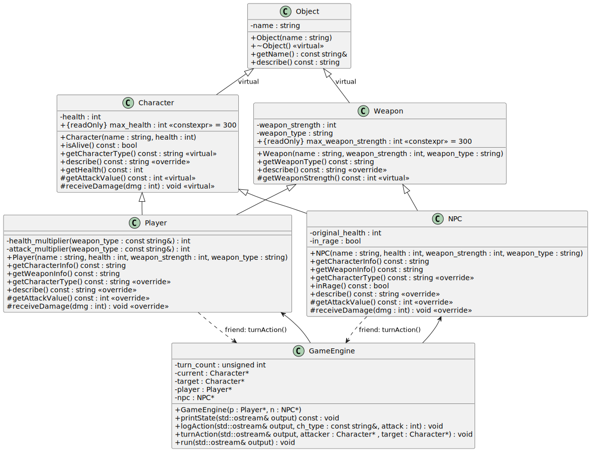

# Mini Game Engine - Inheritance and Friend Classes (C++)

## 1. Purpose and Learning Objectives

In this assignment, you will design and implement a small turn-based role-play combat simulation that demonstrates **inheritance**, **virtual functions**, and **friend functions** in C++.

You will build a minimal game engine in which a **Player** and an **NPC** take alternating turns to attack each other.
Through this exercise, you will:

* Apply **inheritance hierarchies** to express relationships between objects.
* Use **virtual functions** and **overriding** to define polymorphic behavior.
* Employ a **friend function** to coordinate closely related objects.
* Manage object state and formatted console output within a simulation.
---

## 2. Repository Layout

```
hw05_miniGAME_tmp-mini/
├─ include/
│  ├─ catch_amalgamated.hpp (Do not modify or delete it)
│  ├─ test_utils.h (Do not modify or delete it)
│  ├─ Object.h
│  ├─ Character.h
│  ├─ Player.h
│  ├─ NPC.h
│  ├─ Weapon.h
│  └─ GameEngine.h
└─ src/
   ├─ Object.cpp
   ├─ Character.cpp
   ├─ Player.cpp
   ├─ NPC.cpp
   ├─ Weapon.cpp
   ├─ GameEngine.cpp
   └─ hw05_main.cpp
```

You must complete the implementation of the source files in `src/`, except `hw05_main.cpp`.

---

## 3. Class-by-Class Specifications

To implement the role-playing combat game you must implement the classes outlined in the UML diagram provided. You will utilize the following classes:
- **Object**: Abstract base class for all game entities.
- **Character**: Represents a character with health and basic combat functionality.
- **Weapon**: Represents a weapon with type and strength.
- **Player**: A playable character that uses a weapon and benefits from multipliers.
- **NPC**: A non-playable character with rage mechanics.
- **GameEngine**: Controls turn-based combat between Player and NPC.

### A Note About Diamond Inheritance
While implementing multiple inheritance you will explore a diamond inheritance structure. This happens when different classes inherit from a common ancestor base class. For example, you will create a game based on an `Object` class which will serve as a common base class to both `Character` and `Weapon`. The `Player` and `NPC` classes will inherit from the `Character` and `Weapon` classes respectively. This can cause ambiguity when accessing members of the common base class `Object`. To resolve this, **virtual** is used so that the `Object` is not duplicated ensuring that derived classes sare a single `Object` instance. Without virtual inheritance, a `Player` would contain two separate Object subobjects (one through `Character`, one through `Weapon`). This duplicates state (e.g., name, description), causes ambiguity (`player.getName()`-which `Object::getName()`?), and risks double construction/destruction of the base.

By declaring the inheritance from `Object` as virtual in `Character` and `Weapon`, both paths share one Object subobject, owned by the most-derived class (`Player`/`NPC`). This removes ambiguity, keeps a single source of truth for base data, and ensures correct, single construction/destruction. This is why we avoid the diamond problem by using virtual inheritance.

## Class Responsibilities
The following sections describe the responsibilities, member variables, and behaviors of each class.
Expected outputs are illustrated using placeholder notation such as `Name: <name>` where `<name>` should be replaced by the real value.

---

### 3.1 Class `Object`

**Purpose:**
This is the abstract base class for all entities in the game. It provides a common naming interface and a basic textual description.

**Data Member:**

* `name`: a string storing the object's name.

**Constructor:**

* Initializes the object's name with the provided string.

**Destructor:**

* Virtual and defaulted to ensure proper cleanup of derived objects.

**Member Functions:**

* **`getName()`** - Returns the name of the object.
* **`describe()`** - Note that this is a pure virtual method.

---

### 3.2 Class `Character` (inherits from `Object`)

**Purpose:**
You will use this class as a base for any living being in the game, including both players and NPCs. It manages health and defines common combat related behaviors.

**Data Member:**

* `health`: an integer representing the character's remaining hit points. The health is **limited to the range [0,300]**. If the health is outside this range during construction, it should be clamped to the boundary. For example, if health is -10, then the health will be 0.

**Constructor:**

* Accepts a name and an initial health value. The user may input something arbitrarily, so please make sure to initialize the health within legal constraints.

**Public Member Functions:**

* **`isAlive()`** - Returns `true` if the character's health is greater than zero, and `false` otherwise.
* **`getCharacterType()`** - Returns plain text `Character`.
* **`describe()`** - Returns a line describing the character's current state in the format:
  `Type: <character type>, Name: <name>, Health: <health>.`
  The output should end with a period.

* **`getHealth()`** - Returns the current health value.


**Protected Member Functions:**

* **`getAttackValue()`** - Declared as virtual; you will override this in derived classes to define the character's attack strength. Here, it returns 0 since the base character has no weapon. This is actually how older game engines created non-attackable objects such as walls.
* **`receiveDamage(int dmg)`** - Subtracts the given `dmg` value from the character's health, and ensures the health is set to 0 if the health value becomes negative after taking damage.

---

### 3.3 Class `Weapon` (inherits from `Object`)

**Purpose:**
This class represents a weapon that provides a weapon strength which influences the basic attack value. Both the player and NPC privately inherit from `Weapon`.

**Data Members:**

* `weapon_strength`: an integer describing the weapon's attack power. The weapon_strength is limited to the range [0,300]. If the weapon_strength is outside this range during construction, it should be clamped to the boundary. For example, if weapon_strength is 310, then the weapon_strength will be 300.
* `weapon_type`: a string describing the weapon type (e.g., `"Sword"`, `"Bow"`, `"Dagger", etc`).

**Constructor:**

* Accepts the weapon's name, attack value, and type. The input may be arbitrary, so please make sure initialize the weapon strength within the correct bounds.

**Public Member Functions:**

* **`getWeaponType()`** - Returns the type of weapon.
* **`describe()`** - Returns a sentence summarizing the weapon in the following format:
  `Type: Weapon, Name: <name>, It is a <weapon_type> with a weapon strength of <weapon_strength>.`
  The output should end with a period.

**Protected Member Function:**

* **`getAttackBonus()`** - Returns the attack value of the weapon.

---

### 3.4 Class `Player` (inherits from `Character` and privately from `Weapon`)

**Purpose:**
This class represents the human-controlled participant. It combines a character's attributes with those of a weapon.

**Friend Function:**

* The `GameEngine::turnAction` function is declared as a friend, allowing it to access private and protected members directly.

**Static Function:**
Players have experience with the weapon types `Sword`, `Bow`, and `Dagger`. While a player can select any weapon, if they have one of these three special weapon types, the player will receive additional enhancement on health, attack, or both.
The rule is as follows:

| Weapon Type | health enhance factor | attack enhance factor |
| :---------: | :-------------------: | :-------------------: |
|    Sword    |           3           |           1           |
|     Bow     |           2           |           2           |
|    Dagger   |           1           |           3           |
|    Others   |           1           |           1           |

For example, if a player's weapon type is Bow, then the player will get 2× health during construction, and 2× the weapon's attack bonus when calling `getAttackValue()`.
**Note:** The amount of health and attack value still cannot exceed the [0,300] limitation for both health and attack value.

There are two static helper functions used to help you calculate the correct enhancement factor:

* **`health_multiplier(const std::string& weapon_type)`** should return the health enhancement factor based on the weapon type.
* **`attack_multiplier(const std::string& weapon_type)`** should return the attack enhancement factor based on the weapon type.


**Constructor:**

* Takes a name, health, weapon_strength, and weapon_type.
  You should initialize both base classes appropriately.

**Public Member Functions:**

* **`getCharacterInfo()`** - Should return the character's information, formatted as:
  `Name: <name>, Character Type: <character type>, Health <health>.`
  The output should end with a period.

* **`getWeaponInfo()`** - Return weapon's information, formmatted as:
  `Name: <name>, Weapon Type: <weapon type>, Attack Bonus: <attack bonus>\nThe player has an attack multiplier of <attack enhance factor>.`
  The output should end with a period.

* **`getCharacterType()`** - Returns a specialized type label depending on the weapon, specifically:

  * "Player(Warrior)" for a sword
  * "Player(Archer)" for a bow
  * "Player(Assassin)" for a dagger
  * "Player" for any other weapon type.

* **`describe()`** - Returns a composite description that includes both character and weapon details, formatted as:
  `Type: <player type>, Name: <name>, Health: <health>, Weapon: <weapon type>, Attack Value: <attack value>.`
  The output should end with a period.

**Protected Member Functions:**

* **`getAttackValue()`** - Returns the player's total attack strength based on the equipped weapon and enhanced attack factor.
* **`receiveDamage(int dmg)`** - Subtracts the given `dmg` value from the player's health.

---

### 3.5 Class `NPC` (inherits from `Character` and privately from `Weapon`)

**Purpose:**
This class represents the non-player character, or enemy, that competes against the player using similar rules.

**Friend Function:**

* The `GameEngine::turnAction` function is declared as a friend, allowing it to access private and protected members directly.

**Data Member:**
* `original_health`: Used to store the initial value of NPC's health
* `in_rage`: used to record if the NPC in rage state or not.

**Constructor:**

* Takes name, health, weapon_strength, and weapon_type, initializing both base classes.

**Public Member Functions:**

* **`getCharacterInfo()`** - Returns the character's information, formatted as:
  `NPC Name: <name>, NPC Type: <character type>, Health <health>.`
  The output should end with a period.

* **`getWeaponInfo()`** - Returns the weapon's information, formatted as:
  `Weapon Name: <name>, Weapon Type: <weapon type>, Attack Bonus: <attack bonus>\nThe player has an attack bonus of <attack enhance factor>.`
  The output should end with a period.


* **`getCharacterType()`** - Returns a specific label depending on the weapon type:

  * "NPC(Warrior)" for a sword
  * "NPC(Archer)" for a bow
  * "NPC(Assassin)" for a dagger
  * "NPC" for all other weapons.

  
* **`describe()`** - Returns a composite description that includes both character and weapon details, formatted as:
  `Type: <NPC type>, Name: <name>, Health: <health>, Weapon: <weapon type>, Attack Bonus: <attack value>.\nIn Rage: <Yes/No>."`
  The output should end with a period.

* **`inRage()` - Used to access NPC rage state. Rage state is dependent on the health after taking damage. See `receiveDamage` function description for more details. Keep in mind if NPC is not alive, then the inRage() should return `false`;

**Protected Member Functions:**

* **`getAttackValue()`** - Returns the weapon's attack bonus.

* **`receiveDamage(int dmg)`** - Subtracts the given `dmg` value from the player's health. For NPCs, if the NPC's health drops to less than or equal to half of its original health for the first time, the NPC will enter a rage state, the damage received will be reduced to `dmg / 2`.
  **Note:** Since both health and damage are integers, the division result will remain an integer using the default rounding down.

---

### 3.6 Class `GameEngine`

**Purpose:**
This class manages the game's main loop and coordinates the interaction between the player and NPC.

**Data Members:**

* `turn_count`: keeps track of the current turn.
* `current`: pointer to the character whose turn it is. By default, it is always initialized to the player (the player always takes the first turn).
* `target`: pointer to the character who will be the target of attacker.
* `player` and `npc`: pointers to the combatants. Either can be `nullptr`.

**Constructor:**

* Accepts pointers to a player and an NPC.
  Sets the player as the initial actor and initializes the turn counter to one.

**Public Member Functions:**

* **`printState()`** - Displays the current game state. The output must include:

  1. A separator line of 5 equal signs.
  2. The current turn number.
  3. The name of the current character (or "None" if not set).
  4. The player and NPC descriptions as produced by their `describe()` functions.
  5. A separator line of 5 equal signs.

* **`logAction()`** - Prints a summary of the current action, indicating which character attacked and how much damage was dealt.
A example output is
`<CharacterType> attacks for <attack value> damage.\n`
`Player(Warrior) attacks for 25 damage.\n`

**`turnAction(Character* attacker, Character* target)`** - This is a friend function of both Player and NPC. It performs the action for a single turn. Since late binding(runtime polymorphism) is used, the target will receive damage from the attacker each turn.


* **`run()`** - Executes the combat loop. The sequence of events is as follows:
  If any of the `current`, `target`, `player`, or `NPC` pointers is nullptr, then the `run` function will return **without** doing anything.

  1. Continue looping as long as both the player and NPC are alive.
  2. At the start of each turn, print the game state.
  3. Call `turnAction()` to take turn.
  4. Increment the turn counter and switch turns.
  5. When one character's health reaches zero(the loop terminates), announce the winner ("Player wins!" or "NPC wins!").

---

## 4. Example Output Trace

```cpp
int main(){
    Player hero{"Herakles", 50, 25, "Club"};
    NPC enemy{"Hydra", 75, 30, "Bite"};
    GameEngine game(&hero, &enemy);
    game.run(std::cout);
    return 0;
}
```

A typical game session should look as follows:

```
=====
Turn: 1
Current Character: Herakles
Player: Type: Player, Name: Herakles, Health: 50, Weapon: Club, Attack Value: 25.
NPC: Type: NPC, Name: Hydra, Health: 75, Weapon: Bite, Attack Value: 30.
In Rage: No.
=====
Player attacks for 25 damage.
=====
Turn: 2
Current Character: Hydra
Player: Type: Player, Name: Herakles, Health: 50, Weapon: Club, Attack Value: 25.
NPC: Type: NPC, Name: Hydra, Health: 50, Weapon: Bite, Attack Value: 30.
In Rage: No.
=====
NPC attacks for 30 damage.
=====
Turn: 3
Current Character: Herakles
Player: Type: Player, Name: Herakles, Health: 20, Weapon: Club, Attack Value: 25.
NPC: Type: NPC, Name: Hydra, Health: 50, Weapon: Bite, Attack Value: 30.
In Rage: No.
=====
Player attacks for 25 damage.
=====
Turn: 4
Current Character: Hydra
Player: Type: Player, Name: Herakles, Health: 20, Weapon: Club, Attack Value: 25.
NPC: Type: NPC, Name: Hydra, Health: 25, Weapon: Bite, Attack Value: 30.
In Rage: Yes.
=====
NPC attacks for 30 damage.
NPC wins!
```

You must ensure that punctuation, spacing, and capitalization match the expected format exactly.

---

## 5. Friendship and Access Control

You should use the friend relationship between `GameEngine::turnAction` and both `Player` and `NPC` to allow direct access where necessary.
Do not expose internal state publicly just to avoid using friendship. The goal is to demonstrate that controlled access through `friend` is both precise and limited.

## Note
In order to receive full credit for this homework assignment you must complete:
- `src/Object.cpp`
- `src/Character.cpp`
- `src/Weapon.cpp`
- `src/Player.cpp`
- `src/NPC.cpp`
- `src/GameEngine.cpp`

Make sure your last push is before the deadline. Your last push will be considered your final submission when uploading to Gradescope.